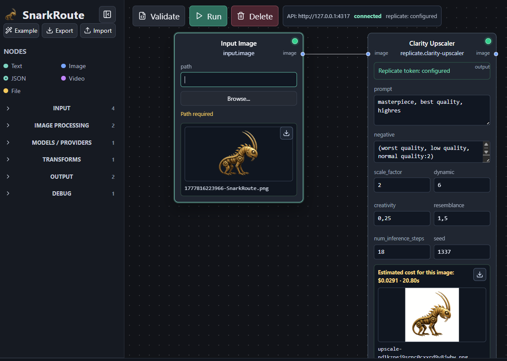

# SnarkRoute

SnarkRoute is the larger project: a local-first reference implementation for portable Open Route Protocol workflows.

BoojumRoute Lab is the working node editor and tool lab you can try today. It is the low-level graph interface for building tools from blocks, routes, providers, executors, schemas, and prompt/library assets.

SnarkRoute Living Canvas is an early experimental shell for the future higher-level creative interface. It is not the main public preview yet.

Both interfaces share the same Open Route Protocol engine/runtime. The current working system lives in BoojumRoute Lab while the SnarkRoute name covers the broader project and the experimental Living Canvas direction.

It allows users to create, inspect, remix, validate, and execute portable AI/model/API routes. Routes describe graphs of operations. Reusable external resources are referenced through AssetRef and resolved by the host through configured AssetSources. This keeps routes portable, auditable, and safer than directly loading arbitrary files or URLs.

Open Route Protocol is a portable route format for describing AI/model/API workflows as graphs. Routes can reference external assets, but only through the AssetRef system. The host application controls how asset references are resolved, validated, cached, embedded, bundled, or blocked.

## Windows Quick Start

Recommended path for the public preview:

```bat
corepack pnpm install
start-boojumroute.bat
```

`start-boojumroute.bat` prepares the required workspace package builds, starts the local API server, waits for `/api/health`, starts BoojumRoute Lab, and opens `http://127.0.0.1:5173`. It uses `corepack pnpm` directly and does not require global `pnpm` or a `.lnk` shortcut.

If you downloaded the GitHub archive instead of cloning with Git:

1. Unzip the archive to a local folder.
2. Open that folder in a terminal.
3. Run the commands above.

Optional: run `setup.bat` to create local Windows shortcuts for the launchers.

## Codex Skill

The Codex skill for creating Boojum `.snarknode` packages is included in this repository at `docs/boojum-node-builder/`.

To install it in Codex on Windows:

1. Download this repository as a GitHub archive or clone it.
2. Copy the `docs/boojum-node-builder` folder to `%USERPROFILE%\.codex\skills\boojum-node-builder`.
3. Restart Codex.

The skill entry file is `docs/boojum-node-builder/SKILL.md`.

## Why This Exists

AI tools are becoming the new creative infrastructure. But most of that infrastructure is being built inside closed platforms: models, workflows, prompts, assets, APIs, billing systems, and execution environments are locked into separate services.

SnarkRoute starts from a different idea: the workflow itself should be portable.

A route should not belong to a platform. It should be a readable, shareable, inspectable document that can connect models, APIs, assets, and tools across providers without directly loading arbitrary external resources from the route itself.

This project is not about hosting one more model, and not about building another central AI platform.

The model is not the center. The route is.

The long-term goal is to support a freer ecosystem of neural tools: not one central gatekeeper, but an open protocol where independent creators and developers can build, share, remix, and execute routes without giving up control of their workflows.

We think of Open Route Protocol as infrastructure for a "free city" of AI tools: many providers, many creators, many routes, no single owner of the road.

SnarkRoute, including BoojumRoute Lab, is the first reference implementation of this idea.

## Demo



A simple image-processing route:

```text
local image input -> Replicate Clarity Upscaler -> local output preview
```

[Watch a short demo video](docs/videos/snarkroute-clarity-demo.mp4)

See `docs/demo-script.md` for a short recording plan.

## What Is Open Route Protocol?

Open Route Protocol uses explicit file extensions for portable route documents. `.orp` is the canonical user-facing extension for complete Open Route Protocol route documents; `.orp.json` and `.orp.yaml` are explicit developer-friendly variants; `.route` remains supported as a human-readable compatibility alias.

Route files contain node instances, edges, params, provenance, economics metadata, and AssetRefs. Reusable external resources are assets resolved by the host, not raw files or URLs loaded directly by the route.

Node definition files such as `.node.json` describe reusable low-level BoojumRoute block types. Future Node Definition Assets may also describe interfaces and execution adapters through AssetRef, but they must not inject arbitrary executable code into the shared runtime.

SnarkRoute is not a wrapper for any single provider. Replicate, Gemini, OpenRouter, Polza.ai, and future providers are provider layers inside routes; the route/workflow is the primary unit of value.

## Commons Principle

SnarkRoute is designed as a portable route language, not a closed platform. Nodes are free protocol components; paid value belongs to execution, services, APIs, support, route authorship, and final products. See `docs/commons-principle.md`.

## Asset System

SnarkRoute uses a two-level asset architecture:

- Route level: routes contain nodes, edges, params, and AssetRefs. Routes do not directly load files, URLs, JSON, Markdown, node definitions, or executable resources.
- Asset resolution level: the host application has configured AssetSources. AssetResolver takes an AssetRef and resolves it to a normalized asset, validating schema, kind, version, hash, permissions, and trust rules where applicable.

An AssetRef stored in a route looks like:

```json
{
  "uri": "asset://local/text/prompt/image-generation/retro-futuristic-editor-joke",
  "kind": "text/prompt",
  "expectedHash": "sha256:...",
  "version": "1.0.0"
}
```

AssetSources can be local folders, embedded route assets, bundles, remote manifests, GitHub repositories, or future provider-specific sources. The route stores the reference; the host decides whether the asset can be resolved, cached, embedded, bundled, or blocked.

See `docs/assets.md`.

## Current Status

Ready to try:

- BoojumRoute Lab
- route creation and execution
- prompt library nodes
- installable `.snarknode` packages
- drag-and-drop node import
- missing-node placeholders
- provider-backed nodes when local provider settings are configured

Early/experimental:

- SnarkRoute Living Canvas
- installer polish
- provider setup UX

## Current MVP Features

- Open Route Protocol v0.1 schema, parsing, validation, YAML and JSON support
- DAG executor with topological sorting, cycle detection, template references, logs, and run results
- Local filesystem run storage under `data/runs/`
- Local ledger accounting under `data/ledger/runs.jsonl`
- Built-in nodes for text, files, images, videos, templates, debug logs, text output, image preview, and file output
- Provider adapters for local server-side execution
- Vite + React + React Flow BoojumRoute Lab
- Import/export Open Route Protocol documents, preferring `.orp`
- Local provider settings through `.env` or Studio Settings where supported

For the early SnarkRoute Living Canvas shell, run:

```bat
start-snarkroute.bat
```

It starts the experimental shell and opens `http://127.0.0.1:5174`.

Default one-click ports:

- API: `http://127.0.0.1:4317`
- BoojumRoute Lab: `http://127.0.0.1:5173`
- SnarkRoute Living Canvas: `http://127.0.0.1:5174`

If a port is busy, the launcher prints a message such as:

```text
Port 4317 is busy. Another shared API instance may already be running.
```

Close the other SnarkRoute windows or run `stop-snarkroute.bat`, then start again. The stop script is intentionally safe: it does not kill every `node.exe` process on your machine.

If BoojumRoute Lab says the API is disconnected, check that the server window is running. The message will include the exact API URL the Lab is trying to reach.

## Manual Start

```bash
corepack pnpm install
corepack pnpm -r build
corepack pnpm start:boojumroute
```

`corepack pnpm start:boojumroute` runs the local Fastify server and BoojumRoute Lab in parallel.

For Living Canvas:

```bash
corepack pnpm start:snarkroute
```

You can also run workspaces separately:

```bash
corepack pnpm dev:server
corepack pnpm dev:studio
corepack pnpm dev:snarkroute
```

The API listens on `http://127.0.0.1:4317` by default. BoojumRoute Lab runs on `http://127.0.0.1:5173` and connects to `VITE_API_BASE_URL`, defaulting to `http://127.0.0.1:4317`. SnarkRoute Living Canvas runs on `http://127.0.0.1:5174`.

For checks:

```bash
corepack pnpm test
corepack pnpm build
```

## Dev Ports

SnarkRoute uses explicit local dev ports so two clones do not accidentally talk to the same backend.

Server:

```bash
API_PORT=4317 corepack pnpm dev:server
```

Studio:

```bash
VITE_API_BASE_URL=http://127.0.0.1:4317 corepack pnpm dev:studio
```

For a second clone, use a different API port and point that clone's Studio at it:

```bash
# Clone A
API_PORT=4317 corepack pnpm dev:server
VITE_API_BASE_URL=http://127.0.0.1:4317 corepack pnpm dev:studio

# Clone B
API_PORT=4318 corepack pnpm dev:server
VITE_API_BASE_URL=http://127.0.0.1:4318 corepack pnpm dev:studio
```

On Windows PowerShell:

```powershell
$env:API_PORT="4318"; corepack pnpm dev:server
$env:VITE_API_BASE_URL="http://127.0.0.1:4318"; corepack pnpm dev:studio
```

Studio shows the active API URL, connection status, and provider token status in the UI. If the API is not reachable, it shows the API URL the Lab is trying to reach.

## Configuring API Tokens

The app should start without API keys. Provider-backed nodes will ask for the relevant local settings before they can execute against external services.

In Studio:

1. Open `Settings`.
2. Open `Secrets`.
3. Choose the provider.
4. Paste the token and save it.

Studio shows only whether the token is `configured` or `missing`. It never reads the token value back from the server.

Fallback: copy `.env.example` to `.env` and add only the keys you use:

```env
REPLICATE_API_TOKEN=your_token_here
GEMINI_API_KEY=your_token_here
OPENROUTER_API_KEY=your_token_here
POLZA_AI_API_KEY=your_token_here
```

Tokens are stored locally and used only by the server. They are not exported with routes or bundles. Do not commit `.env`.

## Smoke Tests

Live smoke tests are not part of the normal test suite because they call external providers.

```bash
corepack pnpm smoke:replicate
corepack pnpm smoke:clarity
```

They require `REPLICATE_API_TOKEN`. They must not print or store the token.

## Example Routes

Canonical examples live in `examples`:

- `basic.orp`
- `upscale.orp`
- `replicate-flux.orp`
- `flux-to-upscale.orp`

Compatibility YAML examples remain in `examples/routes`.

Example route documents are licensed under CC BY-SA 4.0 unless otherwise stated.

## Local Input Nodes

Studio supports local input nodes:

- `input.file`
- `input.image`
- `input.video`

Add one from the node library, then use `Browse...` or drag a local image onto the canvas. The selected absolute path is stored in `params.path` and exported as part of the route document.

Absolute local paths are an MVP limitation for direct input nodes: they work well on the current machine, but reduce portability when sharing routes. Reusable resources should move toward AssetRef instead of direct paths.

## Prompt Library Node

`library.prompt` is the first user-facing example of the Asset System. It outputs a saved prompt or text snippet as `{ "text": "..." }`, so other nodes can use it through normal text ports or template references such as `{{prompt1.output.text}}`.

Prompt Library is a Text Asset source. The node stores only `params.assetRef`; it does not store linked or embedded modes.

Prompt files live under `data/prompt-library/`. The backend should discover files matching `data/prompt-library/**/*.prompt.md` on startup and when Studio's `Refresh Prompt Library` button is clicked.

Each `.prompt.md` file uses YAML frontmatter plus a Markdown body:

```markdown
---
id: retro-futuristic-editor-joke
title: Retro-futuristic editor joke
kind: text/prompt
category: image-generation
description: Demo prompt for a playful SnarkRoute easter egg
tags:
  - demo
---

A retro-futuristic easter egg illustration about building our own visual AI editor with blackjack and courtesans, playful but not explicit, cinematic, detailed, humorous.
```

The `.prompt.md` files are for human editing. Internally, discovered files are normalized into JSON-compatible asset metadata or manifest structures. Prompt files should not need manual registration in code, and one central `prompt-library.json` should not be the human editing surface.

```json
{
  "id": "prompt1",
  "type": "library.prompt",
  "params": {
    "assetRef": {
      "uri": "asset://local/text/prompt/image-generation/retro-futuristic-editor-joke",
      "kind": "text/prompt"
    }
  }
}
```

At execution time, `library.prompt` asks AssetResolver to resolve `assetRef`. The resolved asset must be `text/prompt` or a compatible text asset kind. The node does not know whether the prompt came from a local `.prompt.md` file, generated manifest, embedded route asset, exported bundle, remote manifest, or future provider.

See `docs/prompt-library.md`.

## Export Modes

Linked, embedded, and bundle are export modes, not node params.

- Linked export keeps AssetRefs. The importing host must have compatible AssetSources.
- Embedded export resolves selected assets during export and embeds them into the route document.
- Bundle export packages the route and assets together, for example `my-route.orp.zip` with `route.json`, `assets.manifest.json`, and asset files.

See `docs/export.md`.

## Clarity Upscaler Example

SnarkRoute includes a model-specific node for Replicate Clarity Upscaler:

```text
input.image -> replicate.clarity-upscaler -> preview.image -> output.file
```

In Studio:

1. Add `Input Image`, choose or drop a local image.
2. Add `Clarity Upscaler`.
3. Connect the image port from `Input Image` to `Clarity Upscaler`.
4. Adjust `prompt`, `negative_prompt`, `scale_factor`, `dynamic`, `creativity`, `resemblance`, `num_inference_steps`, and `seed` directly in the node.
5. Use `Image Preview` to view the result, or `Save Text File`/`Output File` when you explicitly want a local route output artifact.

Downloaded model outputs are stored under:

```text
data/runs/<runId>/assets/
```

Replicate output URLs may expire, so SnarkRoute downloads the first returned image locally when the Clarity run succeeds.

## Economics Metadata And Run Accounting

SnarkRoute v0.1 stores economics as metadata and local accounting only. It does not execute payments, settlements, marketplace actions, checkout, billing API calls, blockchain calls, or share payouts.

Routes can include authors, contributors, revenue splits, provider cost hints, currency, and notes. Every run gets a local accounting summary with `paymentExecuted: false`, provider usage events such as Replicate prediction ids, and estimated/actual provider costs when known. Actual provider cost may be `null`.

The ledger is local, ignored by git, and not exported with route documents:

```text
data/ledger/runs.jsonl
```

Secrets such as API tokens are not stored in economics metadata or ledger entries.

## Security Notes

- Do not commit `.env`, local runs, local assets, generated outputs, or private user files.
- Routes and bundles must not contain secret values.
- Routes do not directly fetch arbitrary files or URLs.
- External AssetSources must be explicitly configured by the host.
- Asset manifests must be schema-validated, and asset kind must match what the node expects.
- Hash pinning should warn about changed assets and support reproducible routes.
- SnarkRoute does not execute arbitrary community JavaScript.
- Future community nodes and remote Node Definition Assets must be declarative manifests with explicit permissions and execution adapters, not arbitrary downloaded code.
- Credentials remain host-side and are never embedded into routes.
- External provider outputs are the user's responsibility and are subject to provider/model/service terms.

See `SECURITY.md` and `docs/security.md` for more detail.

## Current Limitations

- No authentication
- No cloud deployment
- No user accounts
- No marketplace
- No payments
- No arbitrary community JavaScript execution
- No complex database
- Absolute local input paths reduce route portability
- AssetRef, AssetSource, and AssetResolver are not fully implemented yet
- Linked, embedded, and bundle export modes are still roadmap items
- Provider actual costs may be unknown

## Roadmap

See `docs/roadmap.md`.

Short version:

- Milestone A: stable MVP foundation
- Milestone B: AssetRef foundation
- Milestone C: Prompt Library as the first Text Asset source
- Milestone D: linked, embedded, and bundle export modes
- Milestone E: cautious remote AssetSources
- Milestone F: Node Definition Assets
- Milestone G: provider/API nodes and demo routes
- Milestone H: Photoshop plugin integration
- Milestone I: early-user preview

## Contributing

See `CONTRIBUTING.md`.

Code contributions are accepted under AGPL-3.0-or-later. Documentation, specification, and example route contributions are accepted under CC BY-SA 4.0 unless otherwise stated.

## License

SnarkRoute source code is licensed under AGPL-3.0-or-later.

Open Route Protocol specification, documentation, and example route documents are licensed under CC BY-SA 4.0 unless otherwise stated.

Generated outputs created by users through SnarkRoute are not automatically covered by AGPL or CC BY-SA and belong to their creators/users, subject to the terms of the models, APIs, routes, and services used.

Third-party dependencies are governed by their own licenses.

See `LICENSES.md` for the full project license map.
